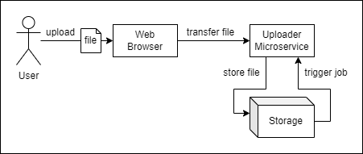

# Large File Upload Workflow

This is a small project to explore how to trigger a file processing job through a file upload web application. 



The requirements for the project are as follows:

**Functional Requirements (How system must work)**

- Allow user to upload file via HTTP.
- Trigger a job to process the uploaded file.

**Non-Functional Requirements (How system should perform)**

- File Upload
    - System should support large file uploads of up to 1GB each.
    - System should support multiple file uploads.
    - System should support file upload of the same file multiple times.
- File Processing
    - System should process one file at a time.
- Others
    - System should be able to scale up to an enormous number of users.
    - System should be able to handle high number of reads and writes.
    - There should be minimum latency in file transfer.

**Design Considerations**

- HTTP vs FTP vs S3 for File Upload

## Architecture Design

## Usage

1. Start Uploader Backend

   ```bash
   ./gradlew uploader-fs:bootrun
   ./gradlew uploader-minio:bootrun
   ```

2. Start Uploader Frontend

   ```bash
   yarn --cwd "./webapp" install
   yarn --cwd "./webapp" start
   ```

3. Try to upload a file through the web application and watch the logs of the uploader service.


## References / Credits

- File Upload System Designs
    - [https://uploadcare.com/blog/handling-large-file-uploads/](https://uploadcare.com/blog/handling-large-file-uploads/)

